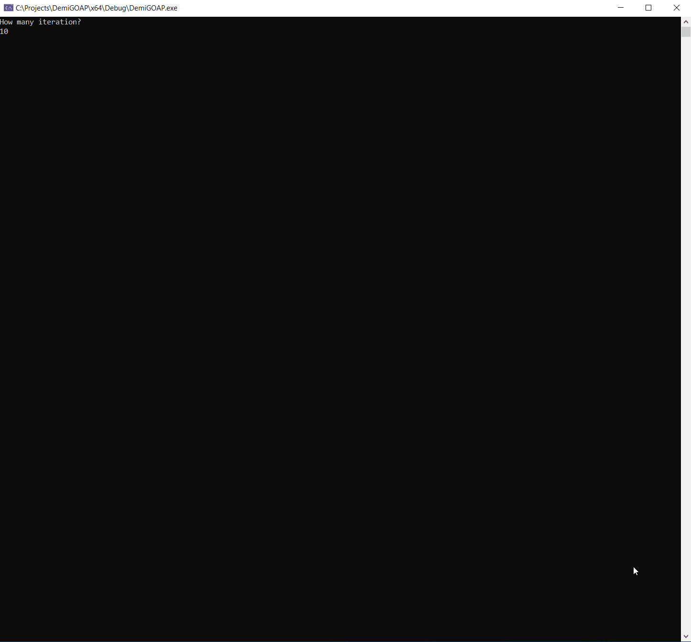

# DemiGOAP

DemiGOAP is a GOAP planner (Goal Oriented Action Planner) for AI (game or not, it depends if you want a planner or another approach). 
I named the project after the meaning of "Demi": it can means something is not "totally" something or not a "whole" of something. 
This because I spent more time writing the A* algorithim behind, because actually, a GOAP, is simple a pathfinding across nodes. 
Now, the current A* implemented is generic and it uses request made up of anything you want, in this case by world states and actions for the GOAP, but you can use for everything. 
The only thing you have to do is taking care to implement the functions the A* needs. 
This GOAP implementation works with float costs instead of simple boolean cost of the normal GOAP approach, because is A* strong based, this is interesting to have very specific balance. 
In fact this approach floor the road toward a self balancing GOAP able to adjust the cost of the action based on the outcome of other actions on the gameplay side: 
The plan is computed, saction in gameplay taking times such 'smelting ore' hence, if something happens to the agent performing this very step planned, the cost is increased and the next time might plan another solution for the same goal. 

## Demo

The demo is a simple console text base application, where I made a lumberjack. 
You have to select the number of iterations (working days) and the name of the lumberjack. 
Than the planner will starts: to show the A* behind is working good with the planner, I have added oddities in the lumberjack test, such axe can be break or cannot be found, during different working days. 

This is a screenshot:

## LICENSE

- Sources:
	- **DemiGOAP**, the main project, is under MIT License

# Build Status

| Platform | Build Status |
|:--------:|:------------:|
| Windows (Visual Studio 2019) |  |
