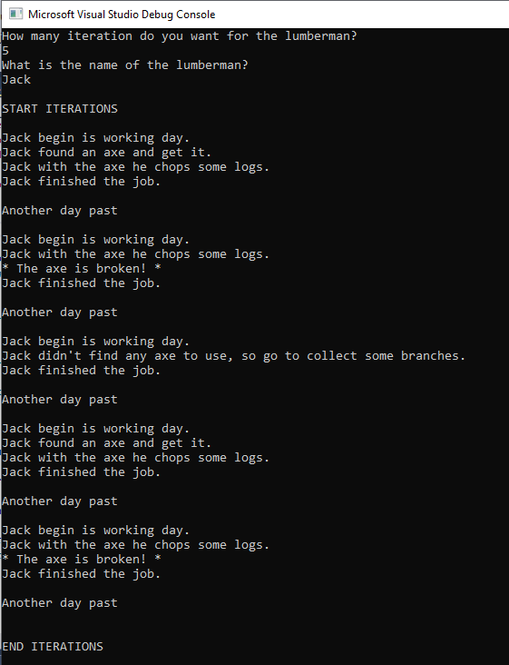

# DemiGOAP

DemiGOAP is a GOAP planner (Goal Oriented Action Planner) for AI (game or not, it depends if you want a planner or another approach). 
I named the project after the meaning of "Demi": it can means something is not "totally" something or not a "whole" of something. 
This because I spent more time writing the A* algorithim behind, because actually, a GOAP, is simple a pathfinding across nodes. 
Now, the current A* implemented is generic and it uses request made up of anything you want, in this case by world states and actions for the GOAP, but you can use for everything. 
The only thing you have to do is taking care to implement the functions the A* needs. 
Moreover, this GOAP implementation, using a strong A* component, can work with floating cost instead of simple integer cost of the normal GOAP approach, thanks the strong base A*, this is interesting to have very specific balance. 

## Demo

The demo is a simple console text base application, where I made a lumberjack. 
You have to select the number of iterations (working days) and the name of the lumberjack. 
Than the planner will starts: to show the A* behind working good with the planner, I have added oddities in the lumberjack test, such axe can be break or cannot be find, during the different working days. 

This is a screenshot:

## LICENSE

- Sources:
	- **DemiGOAP**, the main project, is under GPL-3.0

# Build Status

| Platform | Build Status |
|:--------:|:------------:|
| Windows (Visual Studio 2017) |  |
